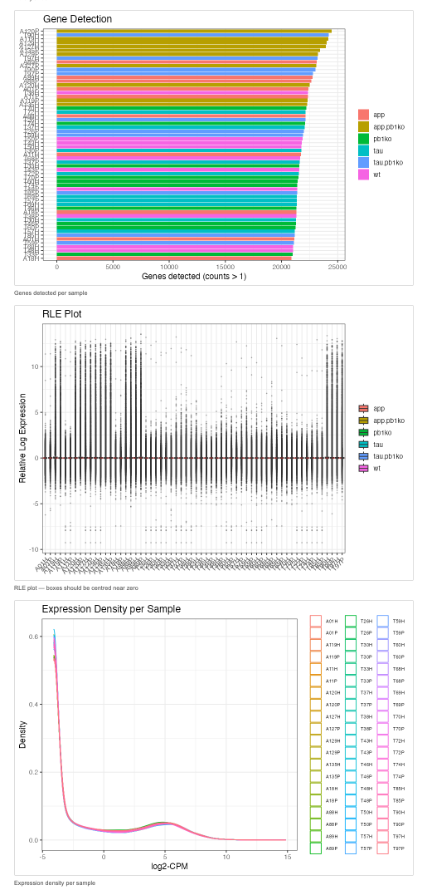

# Bulk RNA-seq Differential Expression App

An interactive R Shiny application for differential expression analysis of bulk RNA-seq data. Supports multiple algorithms, quality control visualisations, and cross-algorithm comparison — no coding required.

🚀 **[Launch the App](https://your-username.shinyapps.io/rnaseq-de-app/)**

---

## Overview

Upload your count matrix and sample metadata, configure your contrast, and explore differential expression results across three statistical frameworks — all from your browser.

| QC Tab | Volcano Plots | Algorithm Comparison |
|--------|--------------|----------------------|
|  |  |  |

> Add your own screenshots to a `screenshots/` folder to populate the table above.

---

## Features

- **Three DE algorithms** — DESeq2, edgeR (TMM + QLF), and limma-voom, selectable individually or together
- **Flexible contrast design** — choose any treatment factor, test level, and reference level from your own metadata
- **QC dashboard** — PCA and sample-to-sample distance heatmap rendered immediately after upload
- **Volcano plots** — one per algorithm, with interactive significance thresholds
- **Algorithm comparison** — Venn diagram of significant genes across methods and a consensus table of genes called DE by all selected algorithms
- **Downloadable results** — combined results table exported as CSV

---

## Using the App

1. **Open** the app at the link above — no installation needed
2. **Upload** your count matrix and sample metadata CSV files (see format below)
3. **Select** a treatment factor, test level, and reference level from the dropdowns
4. **Choose** one or more algorithms (DESeq2, edgeR, limma-voom)
5. **Set** your adjusted p-value and |log2FC| significance thresholds
6. **Click** *Run Analysis* and explore results across the four tabs
7. **Download** the full results table as a CSV

> **New to the app?** Download the example dataset from [Synapse (syn26448162)](https://www.synapse.org/Synapse:syn26448162) to try it out right away.

---

## Input File Format

### Gene Count Matrix (CSV)

Rows are genes, columns are samples. The first column is used as row names (gene IDs).

```
,Sample1,Sample2,Sample3,Sample4
GeneA,120,134,98,110
GeneB,540,612,489,573
GeneC,23,19,31,27
```

### Sample Metadata Table (CSV)

Each row is a sample. Column names become selectable treatment factors in the app.

```
sample,condition,batch
Sample1,control,1
Sample2,control,2
Sample3,treated,1
Sample4,treated,2
```

> Sample order must match the columns in the count matrix.

---

## Algorithms

| Algorithm | Method | Normalisation | Best For |
|-----------|--------|---------------|----------|
| **DESeq2** | Negative binomial GLM | Median of ratios | General use, robust with replicates |
| **edgeR** | Negative binomial GLM (QLF) | TMM | General use, flexible model design |
| **limma-voom** | Linear model on log-CPM | TMM | Large datasets, complex designs, smaller sample sizes |

Running multiple algorithms and focusing on consensus genes improves confidence in your results.


## Dependencies

| Package | Source | Version |
|---------|--------|---------|
| shiny | CRAN | ≥ 1.7 |
| DESeq2 | Bioconductor | ≥ 1.38 |
| edgeR | Bioconductor | ≥ 3.40 |
| limma | Bioconductor | ≥ 3.54 |
| DT | CRAN | ≥ 0.27 |
| ggplot2 | CRAN | ≥ 3.4 |
| pheatmap | CRAN | ≥ 1.0.12 |
| ggVennDiagram | CRAN | ≥ 1.2 |
| ggrepel | CRAN | ≥ 0.9 |

---


